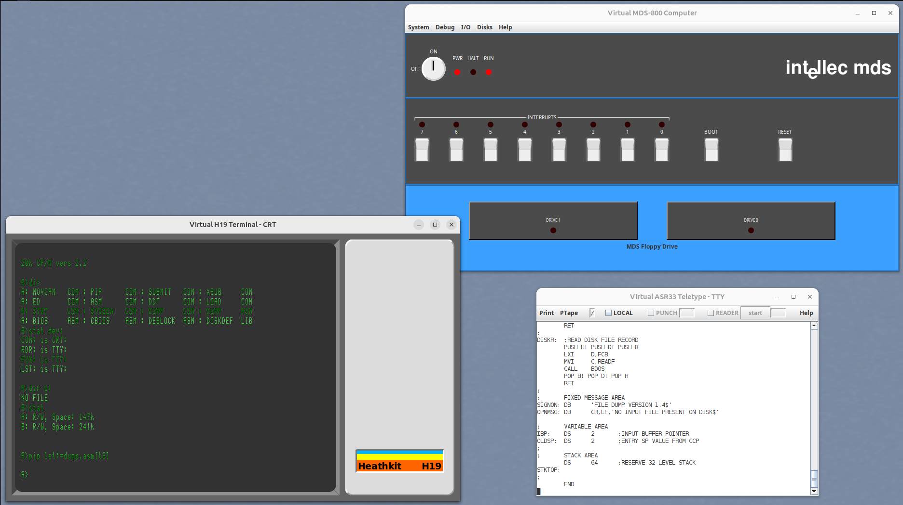

# MDS-800 Simulator

Bootable CP/M floppy image(s) in sim/img.

Example config files in sim/cfg.

JAR files in bin.

An example running the MDS-800 monitor:

An example running stock DRI CP/M 2.2 distribution:

